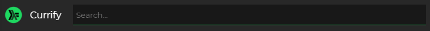
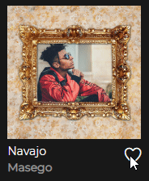
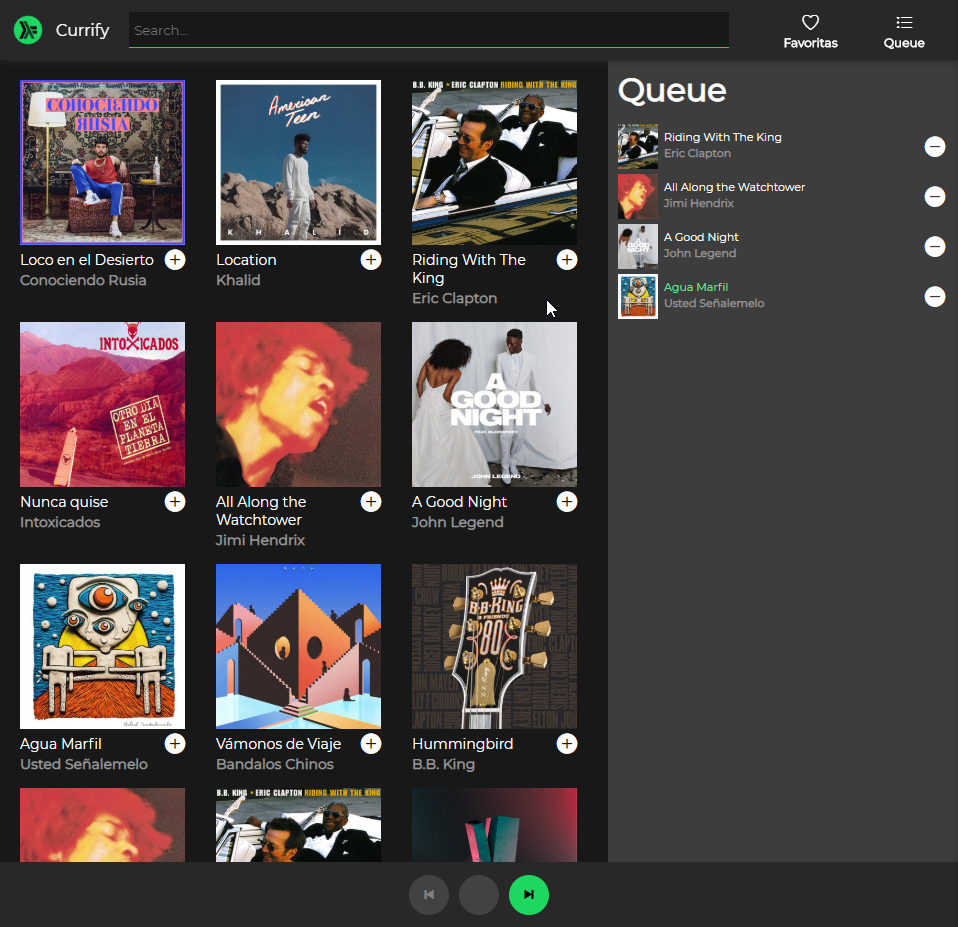

# Contexto

Les docentes de PdeP nos estuvimos contactando con diferentes empresas para ver si podíamos ayudar con el desarrollo de una aplicación web. Una empresa nos llamó y nos pidió que usáramos nuestros conocimientos de funcional para crear una que compita con el más grande de las reproducciones.

Nosotres estuvimos trabajando con todo el desarrollo de la [UI](https://es.wikipedia.org/wiki/Interfaz_de_usuario) y [UX](https://en.wikipedia.org/wiki/User_experience) para una primera versión de esta aplicación, es decir, desarrollamos la parte visual, pero pasaron cosas y ahora estamos cortos de tiempo. Como ya habíamos visto su gran desempeño en haskell, decidimos dejarles el desarrollo de la magia que va a estar conectando toda la lógica por detrás a ustedes, es decir, el desarrollo del [backend](https://es.wikipedia.org/wiki/Front-end_y_back-end).

# Funcionalidades

El primer paso para competir exitosamente es imitar. Tendremos que copiar algunas funcionalidades básicas que ésta tiene:
* Filtrar las canciones, por nombre de aritsta o canción a medida que escribimos en el buscador.  

* Los botones de "Me gusta" y "No me gusta" deberían funcionar. 

* ¡Oh! Me olvidaba... también queremos que se puedan reproducir las canciones (duh).  

# Queue

También queremos implementar una queue donde le usuarie pueda agregar y quitar canciones tocando cuales quiere que se reproduzcan después. Las canciones en cola deberán aparecer a la derecha de la pantalla y desaparecer de allí cuando la empezamos a escuchar.

Nosotres ya nos encargamos de hacer que desaparezcan cuando las estamos escuchando.

# A completar...

Completá los huecos en `src/Backend.elm`, agregando las funcionalidades faltantes que permitan:

* filtrar las canciones por su título o por su artista a medida que se escribe en el buscador.
* dar “me gusta” o “no me gusta” a una canción con el corazón.
* reproducir las canciones haciendo click sobre ellas (estando en / o /home).
* agregar canciones a la cola de reproducción haciendo click sobre la canción (estando en /queue).
* sacarlas de la cola de reproducción, apretando el botón - (de la queue).
* **Bonus**: hacer que cuando una canción de la queue termina empiece a sonar la que sigue, para esto hay que completar la función `playNextFromQueue`.

# Objetivo

El objetivo de este trabajo práctico es ser capaz de aplicar los conocimientos adquiridos en el primer cuatrimestre en programación en general, y en el paradigma funcional y el lenguaje Haskell en particular, para poder construir una aplicación realista simple, utilizando técnicas y tecnologías actuales de construcción de software.

Se puede ver una versión de esta aplicación terminada en https://currify.netlify.com

# Ver más

Para quien quiera continuar aprendiendo, dejamos algunos links más: 
* Sobre [Elm](http://elm-lang.org/), un lenguaje que si bien no es masivo, es muy moderno y tiene [una comunidad creciente](https://stackoverflow.com/questions/tagged/elm).
* Sobre [Redux](https://redux.js.org/), una arquitectura muy popular para construir aplicaciones JavaScript, [que inspira y que se inspira en Elm](https://medium.com/@franzejr/what-elm-and-redux-have-in-common-15fb64ca1dcb).
* Sobre programación [Web en el browser](http://algo3.uqbar-project.org/temario/04-web-client-side) en general.