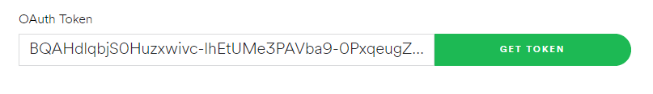
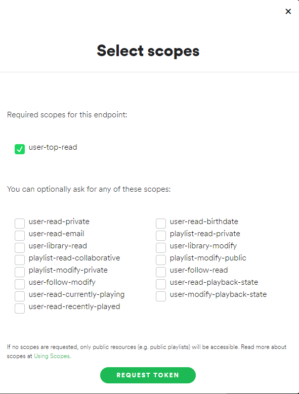
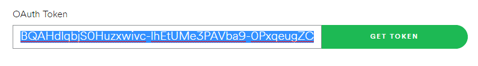

# ¿Cómo usar mis canciones de spotify para currify?

Si querés jugar con el proyecto, y ver las canciones que más escuchás, vas a tener que hacer unas modificaciones por fuera del archivo `src/
Backend.elm`.

Los pasos a seguir son los siguientes:

1. Desde la carpeta del proyecto anda a `json-server/`
2. En esa carpeta crea un archivo `.env`
3. En ese archivo tenes que escribir lo siguiente:
    ```
    SPOTIFY_TOKEN= ...
    ```
    Como te habrás dado cuenta, para poder correr el proyecto con tu cuenta de spotify necesitamos decirle al proyecto que queremos utilizar un usuario (o token) en particular, de donde sacaremos las canciones.
4. Para obtener el token, anda al siguiente link: https://developer.spotify.com/console/get-current-user-top-artists-and-tracks/
5. Hacé click en el botón que dice "GET TOKEN" 
6. Tilda el checkbox que dice `user-top-read`, ese es el único permiso sobre la cuenta que vas a necesitar, es para poder saber cuales son las canciones que mas escuchas.

7. Llená tus datos de Spotify, y dale permisos a la API.
8. Copiá el token nuevo que fué creado, se encuentra al lado del botón de "GET TOKEN".

9. Pegalo en el archivo `.env` que creaste, asignandolo a la variable `SPOTIFY_TOKEN` (reemplazando los `...`)
10. Abrí una consola y en la raíz del proyecto ejecuta el comando `npm run fetch-songs`.
11. Listo! Ahora vas a poder ver las canciones que más escuchas en tu propio `currify`.
